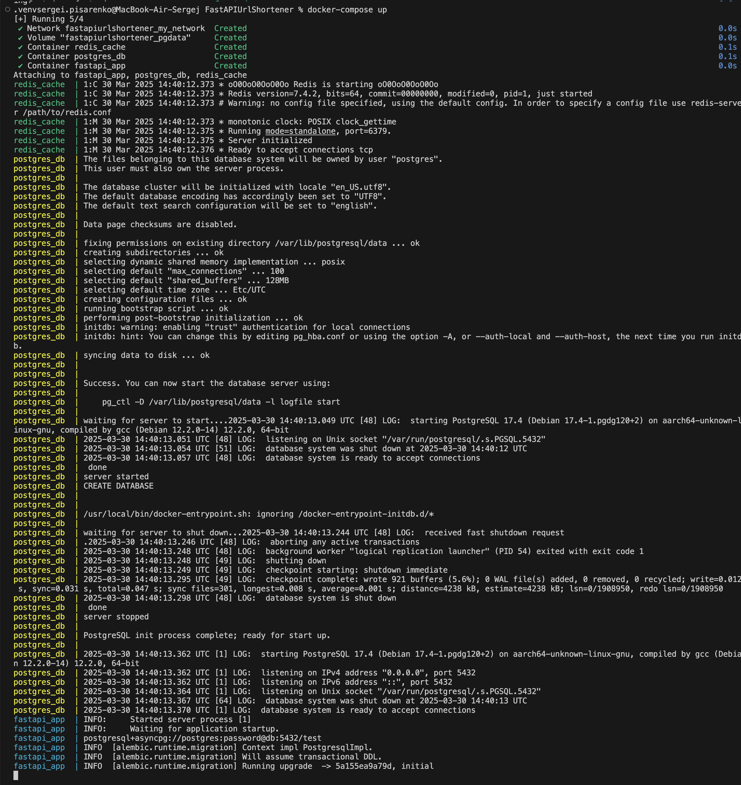

# FastAPIUrlShortener

Приложение для создания коротких ссылок

Приложение состоит из FastAPI для создания изменения и использования коротких ссылок, базы данных PostgreSQL для постоянного хранения данных и Redis для хранения закешированной информации о коротких ссылках.

## Запуск
Для запуска можно использовать docker-compose:
1. Запустить контейнеры  
`docker-compose up --build` - для сборки контейнеров  
Если контейнеры собраны, то:  
`docker-compose up` - для запуска  
или `docker-compose up -d` - для запуска в фоне
2. Остановить контейнеры  
`docker-compose` - для остановки контейнеров  
`docker-compose -v` - для удаления

Вывод запуска docker-compose в терминал:

**После запуска работу сервиса можно проверить с помощью swagger по адрессу `http://localhost:8000/docs#/`**

Также можно запустить без docker-compose:
1. Установить PostgreSQL, Redis
2. Добавить .env файл с переменными:
    - *DB_USER* - Пользователь БД
    - *DB_PASS* - Пароль пользователя БД
    - *DB_HOST* - Хост БД
    - *DB_PORT* - Порт БД
    - *DB_NAME* - Название БД
    - *REDIS_URL* - URL для Redis
3. Запустить PostgreSQL, Redis и main.py в проекте

## API
- **POST** `/links/shorten` – создает короткую ссылку. Возможно указать свою короткую ссылку (будет проверка на занятость ссылки). Для авторизованных пользователей возможен выбор времени жизни ссылки, если указать null, то ссылка создается без времени жизни. Для неавторизованных пользователей ссылка создается на 12 часов;
- **GET** `/links/{short_code}` – перенаправляет на оригинальный URL. Также считает количество переходов и время последнего перехода;
- **DELETE** `/links/{short_code}` – удаляет короткую ссылку авторизованного пользователя;
- **PUT** `/links/{short_code}` – обновляет оригинальный URL и его время жизни, принадлежащий короткой ссылке (для авторизованного пользователя)

**Авторизованный пользователь может изменять и удалять только свои ссылки.**

- **GET** `/links/search?original_url={url}` - поиск всех коротких ссылок, принадлежащих указанному URL;
- **GET** `/links/{short_code}/stats` - показ статистики по короткой ссылке

### Дополнительные эндпоинты:
- **GET** `/links/my_urls` - список коротких ссылок, которые создал авторизованный пользователь;
- **GET** `/events/{short_code}` - просмотр всех событий создания/изменения/удаления короткой ссылки;

## Описание схемы базы данных

* Таблица пользователей `user`:
  - **id** - уникальный ID (UUID) пользователя;
  - **email** - почта пользователя;
  - **hashed_password** - захешированный пароль;
  - **is_active**
  - **is_superuser**;
  - **is_verified**;

* Таблица коротких ссылок `short_url`:
  - **id** - уникальный ID короткой ссылки;
  - **short_name** - заданное короткое имя ссылки;
  - **original_url** - оригинальный URL, на который нужно перейти по ссылке;
  - **user_id** - уникальный ID (UUID) пользователя, создавшего короткую ссылку;
  - **create_time** - время создания ссылки;
  - **modify_time** - время последней модификации ссылки;
  - **redirect_count** - счетчик переходов по ссылке;
  - **last_redirect** - время последнего перехода по ссылке;
  - **expires_at** - время истечения жизни ссылки.

* Таблица событий `events`:
  - **id** - уникальный ID события;
  - **short_url** - короткая ссылка, которой принадлежит событие;
  - **event_type** - тип события (*AddShort*, *UpdateShort*, *RemoveShort*, *ShortIsExpired*, *ShortIsNotUsed*);
  - **datetime** - время, когда событие произошло;
  - **description** - описание события.

## Время жизни ссылок

Для коротких ссылок устанавливается время жизни (12 часов для неавторизованных пользователей). По истечении времени короткие ссылки удаляются из базы данных и Redis с помощью запущенной задачи `delete_expired_links`.

Если короткой ссылкой никто не пользовался 120 дней, то короткая ссылка удаляется за ненадобностью (задача `delete_old_links`).

Инофрмация о короткой ссылке записывается в Redis на 12 часов после создания и синхронизируется с PostgreSQL каждые 5 минут - `sync_clicks_to_db`. Если по короткой ссылке перешли, то данная ссылка кешируется еще на 12 часов.